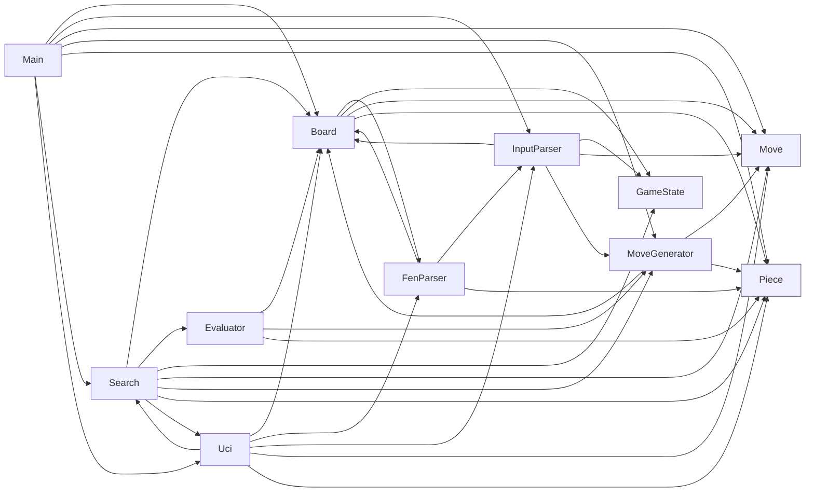

# Chess Engine — Dependency Graph

All source files live in the single `chess` package (`src/chess/*.java`), so
Java `import` statements only reference JDK types. The "real" dependencies
between source files are determined by class references inside each file.

The graph below is directed: an arrow `A --> B` means **A depends on B**
(A references the type `B` in its source). Edge labels show the number of
textual references found.

## Class dependency graph

## Reference counts (A → B : occurrences)

| From          | To             | Refs |
| ------------- | -------------- | ---- |
| Board         | FenParser      | 2    |
| Board         | GameState      | 3    |
| Board         | Move           | 13   |
| Board         | Piece          | 52   |
| Evaluator     | Board          | 10   |
| Evaluator     | MoveGenerator  | 1    |
| Evaluator     | Piece          | 75   |
| FenParser     | Board          | 1    |
| FenParser     | InputParser    | 1    |
| FenParser     | Piece          | 10   |
| InputParser   | Board          | 2    |
| InputParser   | GameState      | 1    |
| InputParser   | Move           | 14   |
| InputParser   | MoveGenerator  | 1    |
| Main          | Board          | 1    |
| Main          | InputParser    | 1    |
| Main          | Move           | 4    |
| Main          | MoveGenerator  | 1    |
| Main          | Piece          | 9    |
| Main          | Search         | 1    |
| Main          | Uci            | 1    |
| MoveGenerator | Board          | 14   |
| MoveGenerator | Move           | 35   |
| MoveGenerator | Piece          | 67   |
| Search        | Board          | 9    |
| Search        | Evaluator      | 1    |
| Search        | GameState      | 2    |
| Search        | Move           | 13   |
| Search        | MoveGenerator  | 1    |
| Search        | Piece          | 8    |
| Search        | Uci            | 1    |
| Uci           | Board          | 5    |
| Uci           | FenParser      | 2    |
| Uci           | InputParser    | 1    |
| Uci           | Move           | 3    |
| Uci           | Piece          | 7    |
| Uci           | Search         | 2    |

## JDK imports per file

| File                | JDK imports                          |
| ------------------- | ------------------------------------ |
| Board.java          | —                                    |
| Evaluator.java      | —                                    |
| FenParser.java      | —                                    |
| GameState.java      | —                                    |
| InputParser.java    | `java.util.List`                     |
| Main.java           | `java.util.List`, `java.util.Scanner` |
| Move.java           | —                                    |
| MoveGenerator.java  | `java.util.ArrayList`, `java.util.List` |
| Piece.java          | —                                    |
| Search.java         | `java.util.List`                     |
| Uci.java            | `java.util.Scanner`                  |

## Observations

- **Leaves** (no project dependencies): `GameState`, `Move`, `Piece` — pure
  data/enum types that everything else builds on.
- **Hubs** (most depended on): `Piece` (6 dependents), `Board` (7
  dependents), `Move` (6 dependents).
- **Cycle**: `Search ↔ Uci` reference each other, as do
  `Board ↔ FenParser` and `FenParser ↔ InputParser` (each forming a
  two-node cycle). Worth noting if you ever try to extract sub-packages.
- **Entry point**: `Main` pulls in the top-level façade classes (`Uci`,
  `Search`, `InputParser`) without touching the lower-level move generator
  or evaluator directly.
